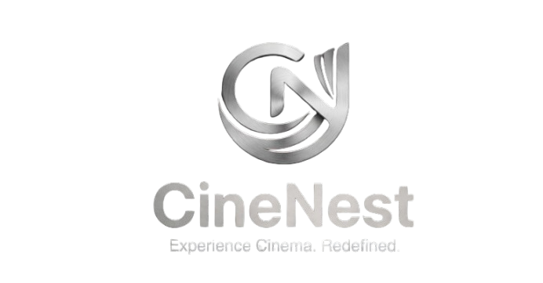

# CineNest

<div align="center">
  
  <br />
  <h1>Experience Cinema. Redefined.</h1>
  <p>
    <strong>Book tickets, explore movies, and reserve seats — all from a cinematic, immersive interface.</strong>
  </p>
  <p>
    <a href="https://react.dev/">
      
    </a>
    <a href="https://spring.io/projects/spring-boot">
      
    </a>
    <a href="https://tailwindcss.com/">
      
    </a>
    <a href="https://supabase.com/">
      
    </a>
  </p>
</div>

---

## 📖 Overview

**CineNest** is an ultra-premium movie ticketing and cinema exploration platform designed to bring the magic of the movies to your screen. From discovering trending blockbusters to visualizing real-time seat availability, CineNest provides a frictionless and visually stunning journey from selection to booking. Featuring a microservices architecture on the backend and a highly dynamic React frontend, CineNest offers a robust, modern ticketing solution.

## ✨ Features

- **🏠 Cinematic Dashboard**: A personalized gateway featuring immersive full-screen hero sections, global city selection, and paginated movie grids.
- **🗺️ Interactive Seat Selection**: A highly intuitive, visual theater seat map that lets you choose your perfect spot with real-time price calculation.
- **📚 Rich Movie Catalog**: Explore dozens of popular movies loaded with comprehensive metadata, stunning posters, and IMDb ratings.
- **📊 User Bookings Hub**: Keep track of all your confirmed tickets with beautiful, printable ticket UI components.
- **🔐 Secure Authentication**: Robust JWT-based authentication system powered by Spring Security and PostgreSQL.
- **🎨 Premium UI/UX**: A thoughtfully crafted, dark-themed custom interface featuring glassmorphism, dynamic gradients, soft micro-animations, and a responsive layout.

## 🛠 Tech Stack

### Frontend
- **Framework**: [React](https://react.dev/) + [Vite](https://vitejs.dev/)
- **Styling**: [Tailwind CSS](https://tailwindcss.com/)
- **Icons**: [Lucide React](https://lucide.dev/)
- **State Management**: Zustand & React Query
- **Animations**: [Framer Motion](https://www.framer.com/motion/)

### Backend (Microservices)
- **Framework**: [Spring Boot](https://spring.io/projects/spring-boot) (Java)
- **Architecture**: Microservices (Auth, Movie, Theatre, Booking)
- **Service Discovery**: Netflix Eureka
- **API Gateway**: Spring Cloud Gateway

### Database
- **Database**: PostgreSQL (Hosted on Supabase)
- **ORM**: Spring Data JPA / Hibernate

## 🚀 Getting Started

Follow these steps to set up both the backend microservices and the frontend locally.

### Prerequisites
- Node.js (v18 or higher)
- Java JDK 17
- PostgreSQL / Supabase account

### Installation

1.  **Clone the repository**
    ```bash
    git clone https://github.com/vanshikapringle/CineNest.git
    cd CineNest
    ```

2.  **Backend Setup**
    The backend consists of multiple Spring Boot services. We have provided convenient PowerShell scripts to start them.
    Navigate to the root directory and run:
    ```powershell
    .\start-backend.ps1
    ```
    This script will automatically start the `auth-service`, `movie-service`, `theatre-service`, and `booking-service` in the background.

3.  **Frontend Setup**
    Navigate to the frontend directory and install dependencies:
    ```bash
    cd frontend
    npm install
    ```
    Ensure your `.env` file points to the API Gateway or individual services.
    Run the Vite development server:
    ```bash
    npm run dev
    ```
    Open `http://localhost:5173` (or the port specified by Vite) to view the application in your browser.

## 🤝 Contributing

Contributions are welcome! Please feel free to submit a Pull Request.

1.  Fork the project
2.  Create your feature branch (`git checkout -b feature/AmazingFeature`)
3.  Commit your changes (`git commit -m 'Add some AmazingFeature'`)
4.  Push to the branch (`git push origin feature/AmazingFeature`)
5.  Open a Pull Request

## 📄 License

This project is licensed under the MIT License.

---

<div align="center">
  <sub>Built with 🍿 by Vanshika Pringle</sub>
</div>
